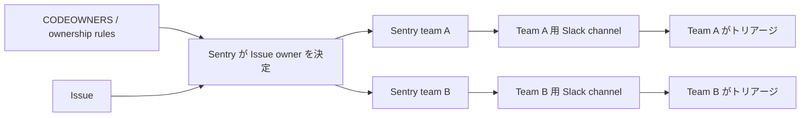

LTK ロスになったので初投稿です。

MOSH でソフトウェアエンジニアをやらせてもらっている Yuki Okushi ([@JohnTitor](https://github.com/JohnTitor))です。

今回は MOSH での Sentry 運用についての課題とそれにどう対処していっているのかについてのお話です。
Sentry 運用の何が課題だったのかを整理し、今 MOSH ではどのようにそれが改善されていっているのかを紹介していきます。

## MOSH でのエラー監視について

MOSH ではエラー監視ツールの一つに[Sentry](https://sentry.io/welcome/)を使っています。
主要なリポジトリでは frontend/backend 問わず Sentry SDK を組み込んでおり、アプリケーションで発生した例外やエラーなどを一元的に捕捉・管理できるようにしています。
そしてそれら（Sentry ではそれらを[Issue](https://docs.sentry.io/product/issues/)と呼びます）を特定の Slack channels に流すことで人間が捕捉・トリアージできるようにしていました。

## 何が問題だったか

以前は Sentry project をリポジトリ単位で分け、発生した Issue もリポジトリ単位でそれぞれの Slack channel に流していました。
この運用は、リポジトリとチームの境界が一致していたり、関与するチーム数が十分に小さかったりするとうまくワークします。
実際、スタートアップ初期などはチームの境界や責任範囲も曖昧です。
下手に分散するより、まとめて見られる方がむしろ都合のいいケースもあるでしょう。

しかし MOSH ではプロダクト開発の加速とともに、チームの数が急激に増加しました。
その上 monorepo で開発しているため、多数のチームが一つのリポジトリで同居する形になりました。
結果として、複数チームのエラーがリポジトリ単位の Sentry project/Slack channel へ無差別に流れ込む状態へ変わりました。

普段のプロダクト開発も忙しい中で、このような誰のボールか分からないものが延々と流れてくる状況にはしんどいものがあります。
歴史的な事情もあり、諸々の背景に詳しい CTO がまずファーストトリアージを行ってそれぞれ関係しそうなチームに差配することで、一応これに対処していました。
一部チームも Linear などを使ってこのトリアージを担ってくれていました。
しかし、誰のボールなのかを判断する作業は結局残り、そこから先の人間によるトリアージがどうしても重くなっていました。


*botと見紛う速度でトリアージする弊社CTO*

この問題意識は、Ubie さん（しにゃいさん）の『[AI フレンドリーなエラー監視を TypeScript で実現する](https://speakerdeck.com/shinyaigeek/ai-hurendorinaerajian-shi-wo-typescript-deshi-xian-suru)』というトークで語られている話に近いです。
実際に弊社でもきちんと Sentry issue をトリアージできていれば未然に防げたかもしれない障害が発生したこともあります。

そんなこんなでいよいよ限界を迎えてきたため、DevOps の一環として改善活動をしていくことにしました。

## どう改善したのか

MOSH ではこの状態を、Sentry の CODEOWNERS と ownership rules で改善しました。
従来 CTO が行っていた差配を、あらかじめ定義された状態を元に機械的にやってしまおうという寸法です。

着想としては、timee さん（須貝さん）の『[モノリスの運用課題を解決するためにコードオーナーをSentryとDatadogに送る - Timee Product Team Blog](https://tech.timee.co.jp/entry/2024/12/14/100000)』というブログを参考にしました。

分け方も色々あるとは思いますが、MOSH ではそれぞれのチームを Sentry 上でも定義し Issue owner をチームにアサインする方式を取りました。
アサインされた Issue は、チームごとに分けた Slack channel へ流しています。
以下のフローチャートのような感じです。



Slack 上での扱い方にも色々あるかとは思いますが、チームはそれぞれ一つの channel に気を配るだけでよい（あるいは、チームとして気を配らなくてよいものは流れてこない）状態を理想としてこのようなフローにしています。

### CODEOWNERS

Sentry にはリポジトリの CODEOWNERS file から Issue assignee を自動導出してくれる機能があります：

https://docs.sentry.io/product/issues/ownership-rules/#code-owners

スタックトレースとソースコードを紐付け、そのファイルに CODEOWNERS が指定されていれば Sentry 側で適切なチームをアサインしてくれるという寸法です（GitHub team と Sentry 上でのマッピングについては後述します）。
この機能を使ってほとんどの Issue を機械的に各チームに割り当てるように変更しました。

CODEOWNERS 機能自体 MOSH では網羅的に活用できていなかったこともありその整備から始めました。
ストリームアラインドチームから「チームの境界が明確になり、エージェントに判断させるときなどにも役立った」との声をもらうなど、嬉しい副産物もありました。
Sentry の Issue triage を改善するために始めた作業でしたが、結果としてコードベースのオーナーシップを整理することにも繋がったわけです。

### GitHub team と Sentry team のマッピング

CODEOWNERS を Sentry で使うには、GitHub の`@org/team`が、Sentry ではどの team に対応するのかを Sentry 上で定義する必要があります。
このマッピングは GitHub からよしなに Sentry 側が取得してくれるわけではなく、手ずからこちらで定義しなければなりません。

https://docs.sentry.io/product/issues/ownership-rules/#external-teamuser-mappings

今ではこういう作業は AI エージェントにやらせやすいものではあるので、スキル化することで同期作業もやりやすくなっていると思います。いい時代ですね。

## ownership rules

CODEOWNERS はスタックトレースベースで assignee を決めるのですが、すべての Sentry Issue がスタックトレースを持っているわけではないなど、100%割り当てを担保することは難しいという問題があります。

代表的なのは、URL ベースで見た方が担当チームを判断しやすい Issue です。
この場合、スタックトレースのファイルパスより request URL で割り当てを行う方が正確で簡単です。

こうした部分は、Sentry の ownership rules で補いました。
ownership rules は`path`、`module`、`url`、`tags.*`などを条件に owner を指定できます。

https://docs.sentry.io/product/issues/ownership-rules/#ownership-rules

```txt
url:https://example.com/foo/**   #foo-team
url:https://example.com/bar/**   #bar-team
tags.transaction:/foo/baz/**     #foo-team
tags.transaction:/bar/baz/**     #bar-team
```

このように割り当ては直感的です。
一方で、増やしすぎると手書きで管理するルールが膨大になります。
そのため MOSH では CODEOWNERS による割り当てを基本として、どうしてもそこで表現できないもののみ ownership rules を手書きするようにしました。

なお、Sentry では ownership rules が CODEOWNERS より優先されます。

https://docs.sentry.io/product/issues/ownership-rules/#evaluation-flow

意図せず CODEOWNERS の指定を上書きしてしまうこともあるかと思うので、そういう意味でも ownership rules の多用には注意すべきかなあと思います。

## 決めなかったことと反省点

Sentry 運用の変更を主導した一方で、それをどうトリアージするかまでは今回定めませんでした。
これはチームごとにフェーズや障害対応のレベル・重大度が異なり、それにより Issue 対応への優先度も変わってくるためです。

とはいえ、どうトリアージすべきかのモデルケースは紹介すべきだったというのが振り返りの中での反省点としてありました。
現に Linear などを使ってトリアージ文化が成熟しているチームがある一方、試行錯誤フェーズにあるチームも見受けられます。
この辺りはうまくやっているチームはどうやっているかを共有するなどして、今後フォローアップしていければと思います。

また、最近は Sentry に悪意のある Issue を記録させ、それを開発者が AI エージェントを介してトリアージすることで攻撃を成立させる Agentjacking という攻撃手法も検証されているようです。
この辺りの対策はまだ考慮できておらず、今後の課題として認識しています。

https://thenewstack.io/agentjacking-sentry-mcp-attack/

## まとめ

今回の変更により、Sentry のトリアージが CTO の手を離れそれぞれのチームで自律してトリアージできる環境を整えることができました。
実際、それぞれのチームでトリアージ活動が始まっており、CTO も空いた時間で楽しく他の仕事をできている様子で一定効果があったように思います。

また、Sentry の機能や細かい挙動には今回初めて知った部分があり、自分にとっても学びのある機会となりました。

ただし前述のようにまだ整備しきれていない課題もいくつかあるので、その辺り含めて今後もやっていきできたらと思います。
